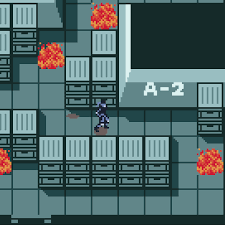
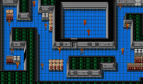
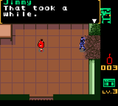

<h1>NAME OF GAME</h1>

<ul>
<li><a href="#story">Story</a></li>
<li><a href="#weapons">Weapons</a></li>
<li><a href="#enemies">Enemies</a></li>
<li><a href="#map">Map</a></li>
<li><a href="#dungeons">Dungeons</a></li>
<li><a href="#items">Items</a></li>
<li><a href="#shop">Shop</a></li>
<li><a href="#todo">To do ...</a></li>
</ul>

<!--
    

    
<b>2030</b>, Super power governments destroyed after <b>World War III</b>. You were a simple soldier in your country squad, but now there is no squad. So you are free to act as a free soldier and make your own squad.

    
In your way: 

    <ul>
        <li>Kill other soldiers and take their money.</li>
        <li>Help people and as a reward take them to your shelter.</li>
        <li>Buy better items ... Better items make you better soldier.</li>
        ...
    </ul>
-->
    <h3>Story</h3>
    
General Bin, sent you to a mission in Derocsid area, which is high protected by enemies. Find documents, steal it and get out of area.

    
In your way: 

    <ul>
        <li>Kill other soldiers and take their money.</li>
        <li>Buy better items ... Better items make you better soldier.</li>
    </ul>

<h3>Weapons</h3>
<table>
<tr>
    <th>Name</th>
    <th>Damage</th>
    <th>Fire Rate</th>
</tr>
<tr>
    <td>Pistol</td>
    <td>10</td>
    <td>1</td>
</tr>
<tr>
    <td>Assault</td>
    <td>20</td>
    <td>0.3</td>
</tr>
<tr>
    <td>Shotgun</td>
    <td>30</td>
    <td>2</td>
</tr>
<tr>
    <td>Rifle</td>
    <td>50</td>
    <td>3</td>
</tr>
</table>

<h3>Enemies</h3>
<table>
<tr>
    <th>Name</th>
    <th>Damage</th>
    <th>Health</th>
    <th>Value</th>
</tr>
<tr>
    <td>Soldier-Lvl1</td>
    <td>5</td>
    <td>10</td>
    <td>1</td>
</tr>
<tr>
    <td>Soldier-Lvl2</td>
    <td>10</td>
    <td>20</td>
    <td>5</td>
</tr>
<tr>
    <td>Soldier-Lvl3</td>
    <td>30</td>
    <td>50</td>
    <td>15</td>
</tr>
<tr>
    <td>FireWall</td>
    <td>50</td>
    <td>200</td>
    <td>50</td>
</tr>
</table>

<h3>Maps</h3>

<h3>Items</h3>
<table>
<tr>
    <th>Name</th>
    <th>Damage</th>
    <th>Speed</th>
</tr>
<tr>
    <td>Land Mine</td>
    <td>100</td>
    <td>---</td>
</tr>
<tr>
    <td>Armor</td>
    <td>---</td>
    <td>---</td>
</tr>
<tr>
    <td>Key</td>
    <td>---</td>
    <td>---</td>
</tr>
<tr>
    <td>Chest</td>
    <td>---</td>
    <td>---</td>
</tr>
<tr>
    <td>Coin</td>
    <td>---</td>
    <td>---</td>
</tr>
<tr>
    <td>Car</td>
    <td>5</td>
    <td>20</td>
</tr>
<tr>
    <td>Helicopter</td>
    <td>1-5</td>
    <td>40</td>
</tr>
<tr>
    <td>AirPlane</td>
    <td>1000</td>
    <td>50</td>

</tr>
<tr>
    <td>Light Tank</td>
    <td>20</td>
    <td>15</td>
</tr>
<tr>
    <td>Medium Tank</td>
    <td>50</td>
    <td>10</td>
</tr>
<tr>
    <td>Heavy Tank</td>
    <td>100</td>
    <td>5</td>
</tr>
</table>

<h3>Shop</h3>
<table>
<tr>
    <th>Name</th>
    <th>Products</th>
    <th>Price</th>
</tr>
<tr>
    <td>Gigili Bomb</td>
    <td>Land Mine</td>
    <td>1</td>
</tr>
<tr>
    <td rowspan = "4">Antonio Weapon</td>
    <td>Pistol</td>
    <td>100</td>
</tr>
<tr>
    <td>Assault</td>
    <td>200</td>
</tr>
<tr>
    <td>Shotgun</td>
    <td>350</td>
</tr>
<tr>
    <td>Rifle</td>
    <td>500</td>
</tr>
<tr>
    <td rowspan="6">Chumbucket Garage</td>
    <td>Car</td>
    <td>1000</td>
</tr>
<tr>
    <td>Helicopter</td>
    <td>5000</td>
</tr>
<tr>
    <td>Airplane</td>
    <td>50000</td>
</tr>
<tr>
    <td>Light Tank</td>
    <td>2500</td>
</tr>
<tr>
    <td>Medium Tank</td>
    <td>7500</td>
</tr>
<tr>
    <td>Heavy Tank</td>
    <td>12500</td>
</tr>
</table>

<b>Weapons: </b> pistol -> ammo 

<b>Item:</b> armor, mine, key 

<b>Enemy:</b><ul><li>Fast: less health</li><li>Slow: tank</li></ul>

<b>Map:</b> 40x40

<b>Screen:</b> 10x10

<b>Box:</b> chest

<b>enemies:</b><ul><li>10% key</li><li>90% money [10...25]</li></ul>

<b>Goal:</b> Find documents and reach destination

<h3>To Do ...</h3>
<input type="checkbox"><label>Add dungeons</label>

 